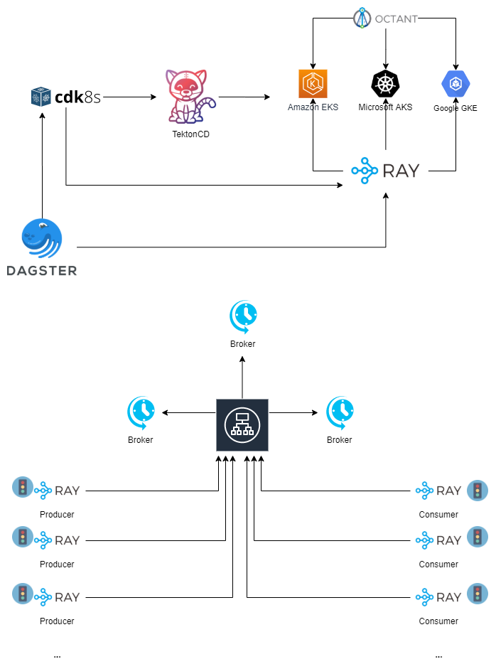

## Project Drone

#### SW Requirements
- programmatic setup and teardown of different broker, producers, consumers configurations 
- support of major k8s cloud native providers
- flow like way of designing and running tests
- simulate network problems 

#### HW Requirements
- MVP broker configuration: 3 x broker nodes behind an Application LB
- fast SSD HDD and higher number of CPUs

#### Proposed tools
- **Dagster** with **Dagit** DAG -  programmatic flows design framework with a powerful web UI development environment
    - project: https://github.com/dagster-io/dagster
    - docs: https://docs.dagster.io/
- **Ray** - framework for building and running distributed applications.
    - project: https://github.com/ray-project/ray
    - docs:  https://docs.ray.io/en/latest/
- **cdk8s** - framwework for defining Kubernetes applications and reusable abstractions programmatically
    - https://cdk8s.io/
    - getting started - https://github.com/awslabs/cdk8s/blob/master/docs/getting-started/python.md
- **Octant** - k8s cluster visualisation tool
    - https://octant.dev/
    - project: https://github.com/vmware-tanzu/octant
- **TektonCD** - k8s native CI/CD pipeline 
    - project: https://github.com/tektoncd/pipeline
    - docs: https://github.com/tektoncd/pipeline/blob/master/docs/tutorial.md
- **tcconfig** - linux traffic shaping tool (wrapper to tc command)
    - project: https://pypi.org/project/tcconfig/
    - docs: https://tcconfig.rtfd.io/

#### Arhitecture Diagram

#### Tools k8s setup
##### Ray
###### Installation
- installation details - https://docs.ray.io/en/master/deploy-on-kubernetes.html
- k8s yml files used for setup - https://github.com/ray-project/ray/tree/master/doc/kubernetes 
- this will create:
    - a **ray-head Kubernetes Service** that enables the worker nodes to discover the location of the head node on start up.
    - a **ray-head Kubernetes Deployment** that backs the ray-head Service with a single head node pod (replica).
    - a **ray-worker Kubernetes Deployment** with multiple worker node pods (replicas) that connect to the ray-head pod using the ray-head Service.
###### Running Ray Programs
- there are three options to run a ray program (https://docs.ray.io/en/master/deploy-on-kubernetes.html#running-ray-programs):
    - using kubectl exec to run a Python script.
    - using kubectl exec -it bash to work interactively in a remote shell.
    - submitting a Kubernetes Job (https://docs.ray.io/en/master/deploy-on-kubernetes.html#submitting-a-job). The Job will run a single pod running the Ray driver program to completion, then terminate the pod but allow you to access the logs.

##### TektonCD
###### Installation
- installation walkthrough - https://github.com/tektoncd/pipeline/blob/master/docs/install.md#installing-tekton-pipelines-on-kubernetes
- artifact storage - https://github.com/tektoncd/pipeline/blob/master/docs/install.md#configuring-a-cloud-storage-bucket
###### Management
- tkn CLI - https://github.com/tektoncd/cli
###### Concepts
- A **Task** defines a series of steps that run in a desired order and complete a set amount of build work. Every Task runs as a Pod on your Kubernetes cluster with each step as its own container 
- A **Pipeline** defines an ordered series of Tasks that you want to execute along with the corresponding inputs and outputs for each Task. You can specify whether the output of one Task is used as an input for the next Task using the from property

